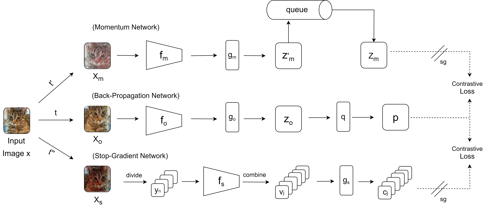

# MNCLGLF
Multi-network Contrastive Learning based on Global and Local Features

## Abstract
  The popularity of self-supervised learning has made it possible to train models without relying on labeled data, which saves expensive annotation costs. However, most existing self-supervised contrastive learning methods often overlook the combination of global and local feature information. This paper proposes a multi-network contrastive learning framework based on global and local features (MNCLGLF). Global features and local features are the outputs of the convolutional network obtained from the entire image and specific regions of the image respectively. The proposed model learns feature information at different scales of an image by contrasting the embedding pairs generated by multiple networks. The framework also expands the number of samples used for contrast and improves the training efficiency of the model. Linear evaluation results on three benchmark datasets show that MNCLGLF outperforms several existing classical self-supervised learning methods.

## Framework

## Linear evaluation
|   Methods  |  CIFAR10   |         |   CIFAR100  |        | TinyImageNet |        |
|:----------:|:----------:|:-------:|:-----------:|:------:|:------------:|:------:|
|            | top1       | top5    | top1        | top5   | top1         | top5   |
| Supervised | 92.89      | 99.84   | 71.93       | 92.21  | 54.03        | 77.02  |
| MoCo V2    | 84.03      | 99.53   | 50.49       | 80.28  | 26.01        | 51.92  |
| SimSiam    | 84.16      | 99.45   | 48.19       | 78.41  | 25.28        | 50.63  |
| SimCLR     | 87.11      | 99.64   | 59.20       | 86.41  | 31.39        | 59.08  |
| BYOL       | 85.58      | 99.58   | 57.12       | 84.83  | 32.76        | 59.55  |
| NNCLR      | 87.66      | 99.63   | 60.91       | 87.50  | 40.46        | 67.05  |
| Fast-MoCo  | 85.93      | 99.57   | 61.39       | 87.31  | 39.91        | 66.26  |
| MNCLGLF    | 90.18      | 99.78   | 65.20       | 89.72  | 41.70        | 68.36  |

## Acknowledgement
This work was supported by the National Natural Science Foundation of China under Grant No. 61906098.
